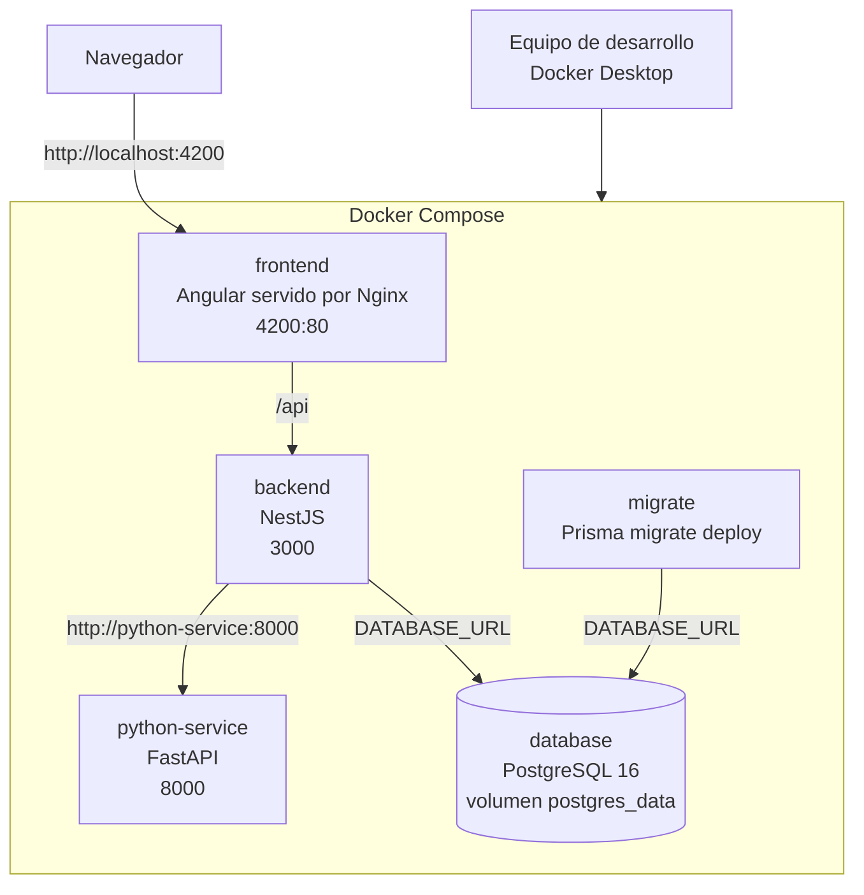

# Despliegue preliminar - EP1

EP1 se ejecuta de forma reproducible con Docker Compose. La infraestructura Terraform incluida en `infra/` documenta el contrato inicial de staging; la selección de proveedor cloud se resolverá en la siguiente etapa.



## Orden de inicio

1. `database` inicia y su health check espera a PostgreSQL.
2. `migrate` ejecuta `prisma migrate deploy` cuando la base está saludable.
3. `backend` inicia solo cuando la migración termina correctamente.
4. `frontend` entrega la aplicación Angular en el puerto `4200`.

## Variables necesarias

| Variable | Uso | Dónde se define |
| --- | --- | --- |
| `POSTGRES_PASSWORD` | Contraseña local de PostgreSQL. | `.env` (basado en `.env.example`). |
| `JWT_SECRET` | Firma de tokens JWT. | `.env`; nunca se versiona. |
| `DATABASE_URL` | Conexión de NestJS/Prisma con PostgreSQL. | La genera Docker Compose internamente. |
| `PYTHON_SERVICE_URL` | URL interna del evaluador. | Docker Compose: `http://python-service:8000`. |

## Comandos de verificación

```bash
docker compose up --build
docker compose ps
curl http://localhost:3000/api/health
curl http://localhost:8000/health
```

Para detener sin borrar la base de datos local:

```bash
docker compose down
```

## Seguridad inicial

- Las claves reales se mantienen en `.env`, ignorado por Git.
- `JWT_SECRET` es obligatorio antes de iniciar NestJS.
- PostgreSQL y FastAPI se comunican por la red privada de Docker Compose; sus puertos expuestos son solo una facilidad de desarrollo y diagnóstico local.
- CI revisa secretos con Gitleaks y crea las imágenes antes de que una modificación sea aceptada.
