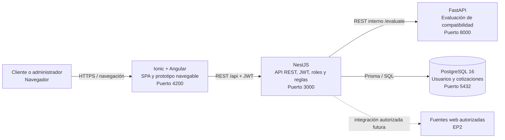

# Diagrama de contenedores - EP1

Este diagrama explica los bloques ejecutables de JembaTech y cómo se comunican. El navegador nunca accede directamente a PostgreSQL ni a FastAPI.

## Responsabilidad por contenedor

| Contenedor | Tecnología | Responsabilidad | Exposición |
| --- | --- | --- | --- |
| Frontend | Ionic + Angular | Interfaz, navegación, formularios y presentación de evaluaciones/cotizaciones. | Pública, `localhost:4200` en desarrollo. |
| API principal | NestJS | Contratos REST, validación de DTO, JWT, roles, reglas de negocio y coordinación. | Pública, `localhost:3000/api`. |
| Evaluador | FastAPI | Calcula puntaje, nivel, advertencias y recomendaciones de una configuración. | Interna; se publica en `8000` solo para revisión local. |
| Base de datos | PostgreSQL 16 | Persiste usuarios, hashes de contraseña y cotizaciones. | Interna; `5432` se expone solo para desarrollo local. |

## Decisiones relevantes

- NestJS es la única puerta de entrada pública de datos: concentra seguridad, validación y errores.
- FastAPI no guarda datos ni entrega JWT; su único propósito es la evaluación especializada.
- La integración con SoloTodo/Instagram no forma parte de EP1. Cualquier consumo futuro requerirá mecanismos y condiciones de uso autorizados.
