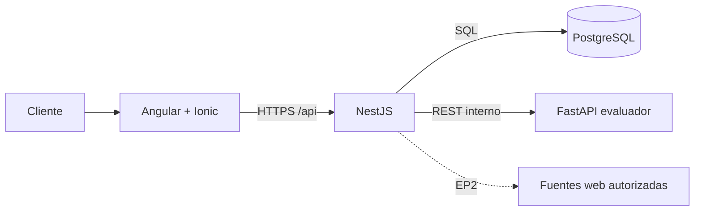

# Diagrama de contexto - EP1

```mermaid
flowchart LR
  U[Cliente] --> F[Angular + Ionic]
  F -->|HTTPS /api| N[NestJS]
  N -->|SQL| P[(PostgreSQL)]
  N -->|REST interno| PY[FastAPI evaluador]
  N -. EP2 .-> W[Fuentes web autorizadas]
```

Flujo demostrable: Angular envia una configuracion a `POST /api/evaluations`; NestJS valida y consulta FastAPI; FastAPI devuelve nota, advertencias y recomendacion.
