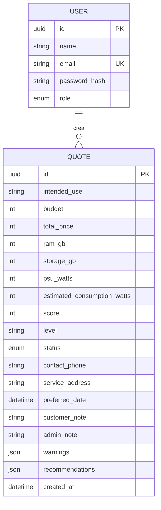

# Modelo de datos inicial - EP1

`USER` y `QUOTE` ya se persisten con Prisma y PostgreSQL. Los roles son `CLIENT` y `ADMIN`; los estados de coordinación son `DRAFT`, `REQUESTED`, `REVIEWING`, `SCHEDULED`, `COMPLETED` y `EXPIRED`. Las entidades `COMPONENT`, `QUOTE_ITEM`, `PRESET` y `PRESET_ITEM` se incorporaran con el catálogo administrable.
