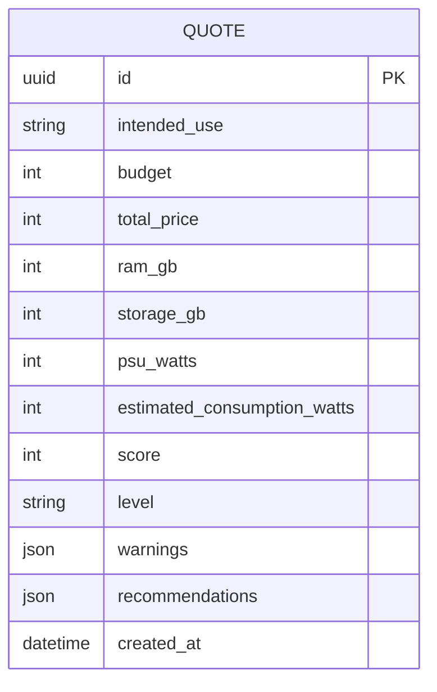

# Modelo de datos inicial - EP1

`QUOTE` es la entidad ya persistida con Prisma y PostgreSQL. Las entidades `USER`, `COMPONENT`, `QUOTE_ITEM`, `PRESET` y `PRESET_ITEM` se incorporaran cuando se implemente autenticacion y catalogo administrable.
